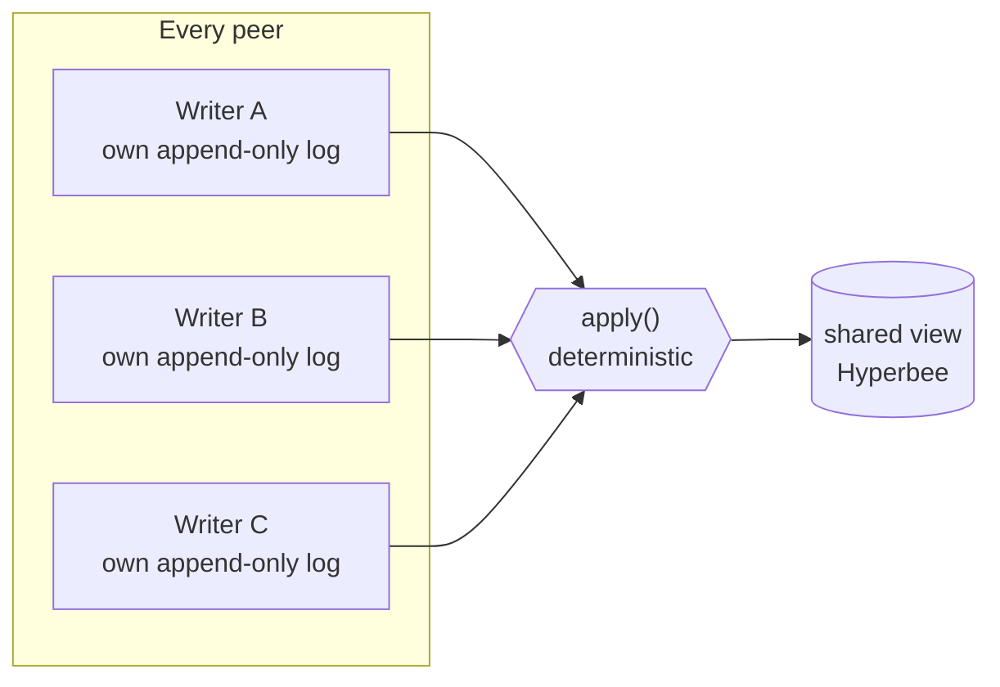
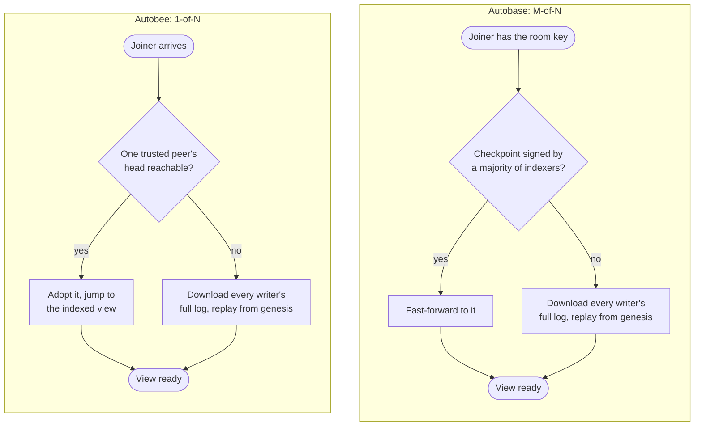

Keet 4.22.0 ships a new engine underneath its rooms. Each room moves onto it the first time your device opens it.

[**Autobee**](https://github.com/holepunchto/autobee) is Keet's new multiwriter engine, built on everything we learned running [**autobase**](https://github.com/holepunchto/autobase) for years.
The core shape hasn't changed:

* Every peer appends to their own signed, append-only log.
* A deterministic `apply` function merges those logs into one shared view.
* No central server owns any of it. Each peer can read and apply all operations independently.

Autobase is still bundled with Keet — it's what migrates a room's old data the first time a device opens that room — but all new room activity runs on autobee.

What autobee actually changes is how a room settles on an order, and, as a direct consequence, how few peers it takes to catch a new device up.

*The shape autobase and autobee both share: each peer's own log feeds a deterministic `apply`, and every peer that has seen the same entries ends up building the same view. What changed is the machinery in the box — how the order going into `apply` gets decided, and what it costs to catch a device up.*

## Why a majority used to stand between you and a fast join

In a Keet room, every peer materializes the room's chat view by processing entries as they arrive and running the same deterministic sort over them. That's expensive, and wasteful: every peer is doing the same work. It would be much more efficient if one peer could do the work and share the result with everyone else.

In Autobase, this work sharing was handled by a process called indexing. When joining a room, Autobase can fast-forward a joiner straight to the tip — but only to the indexed tip; the unindexed portion of the room still has to be computed by each peer independently. In short, the more unindexed state a room has, the slower the join.

<Callout type="info">
To illustrate the difference between indexed and unindexed: imagine that instead of going to a supermarket and finding the shelves fully stocked, you first have to call in the deliveries yourself, stock the shelves yourself, and only then do your shopping.
</Callout>

In practice, we found that many rooms weren't being indexed effectively, so they couldn't benefit from fast joins. The issue is that, in Autobase, indexing is an interactive process that requires a majority of indexers to agree on the ordering. That not only takes time, it's also sensitive to peer availability. Picture a room where enough of the current admins have been offline for a while — on a trip, off the network for whatever reason — that the ones still online can no longer reach a majority. Everyone can still write and read normally; the tip just never gets indexed. For an old, busy room, that's slow.

## How Autobee fixes this

Autobee was designed with a simple principle in mind: every peer should be able to share their work.

In Keet, this means that as soon as any admin writes a message, any new joiner can fast-forward straight to that last message. Since it only takes 1 admin, rather than a majority of admins, joiners can fast-forward much closer to the tip than with Autobase — which translates to much faster joins!

*Autobase's fast-forward only unlocks once a majority of indexers have signed a checkpoint. Autobee's unlocks the moment a single trusted peer's head is reachable — the fallback cliff is still there if nobody trusted has ever been reachable, it's just far less likely to hit.*

## What tradeoffs does Autobee make

### Adjusted trust model

We kept the ordering and dropped the majority. Its sort is adapted more or less directly from autobase's, so every peer still lands on the same order from the same entries — but there's no majority step afterwards, and no round of confirmations to wait on.

Autobee drops the quorum step entirely, and that costs something in its trust model. An autobase view only ever replicated to the network once a majority of indexers had signed it — a real, protocol-level trust anchor: a multisig core, typically the room's admins as signers. In Autobee, each peer has their own view, and it's equally as shareable as any other peer's — the protocol itself no longer distinguishes an admin's view from a stranger's. What used to be a guarantee the protocol gave you for free becomes a judgment call the application has to make instead.

### A single Autobee has many possible histories

Autobase was a one-to-one data structure: given any key, there was only one possible set of views that could arise from it. Autobee drops that property — each peer is free to write their own view, and since there's no quorum, that view is perfectly valid.

In practice, this is only a tradeoff in the academic sense, and the flexibility it offers opens the door to some features we're excited to work on next.

### Keet's security is unchanged

That's not to say Keet is any less secure — it's just that now Keet's own code enforces the security policy itself, rather than relying on the underlying engine. It does this by maintaining an index of admins per room, and a fast-forward checkpoint is only trusted when it came from a device of one of the room's admins. Trust moved out of the protocol and into Keet — which is a better place for it to live, since Keet itself already owned the concept of who's an admin.

<Callout type="info">
If you're a developer used to working with Autobase and looking to transition to Autobee, you'll need to update the trust model in your applications. Enforcing trust is now the application's responsibility, not the engine's.
</Callout>

### Why the tradeoff is worth it

The wins are significant: no more waiting on room joins, no more spinning fans or phones heating up — just fast, reliable room joins.

Autobee was designed with Keet in mind. Autobase remains the right tool when strong consensus is required — the username registry, for instance, will continue to run on Autobase, since it's a public service where reliability and trust are paramount and the system should only ever assign a single username. For Keet, we're dealing with chat rooms, where the priority is performance and privacy. Since the tradeoffs above don't compromise our security or privacy model, we'll happily take the performance gains.

## What happens to rooms you already have

Rooms you had before the upgrade convert once per device, the first time that device opens them — either because you opened the room, or because the app opened it in the background to sync new activity. Rooms your device never opened just sync, with nothing to convert.

The room ID does not change, so old invites and old links still land in the same room. Your old data is not rewritten or discarded: the previous autobase cores are kept read-only so history keeps rendering, for you and for people who join later. The cost: a migrated room is stored twice on your device, and the old copy is never reclaimed.

Above your room list, the app shows a dismissible notice headed "Keet is upgrading for a smoother experience". There is no progress bar: rooms convert in the background as the app catches up, and a room you open yourself converts as part of opening it, so that one takes a moment longer the first time.

Everyone in a room should update. How far a room may upgrade is a moderator action driven by remote config. When a room moves past what an old client supports, that client stops applying the room rather than failing silently — the room freezes where it is, the rest of the app keeps working, and the client raises an update countdown — "Some groups might not work with your current version of Keet. Please update the app to access all your groups." — then restarts into the update when the timer runs out.

If a room doesn't come up after you upgrade, see [Slow groups after updating](https://support.keet.io/technical-support-and-troubleshooting/slow-groups-after-updating).

## Why this matters past this release

The point of the rewrite isn't one number going down. It's a deliberate trade: swapping a heavyweight, majority-vote consensus model — overkill for a chat app — for a lighter one where a single trusted peer is enough to catch a device up. That trade has a price: it gives up the permanent finality and the protocol-level trust guarantee autobase provided. Keet rebuilds the trust side itself, through its admin checks; the finality is simply gone, which a chat app can live with.

It also made Keet simpler:

* **Three views became one.** A room used to carry up to three separate views: the original room view, the newer room database that replaced it, and a separate store for small binary data. On autobee, a room has a single view — its database — so there is one core to replicate, mirror, and fast-forward instead of three.
* **Blob storage was folded into the main database.** Avatars and image previews — small images of up to 512 KB — used to live in their own Hyperblobs core next to the room database. They are now ordinary records inside the database, keyed by a hash of their content, so an image that is already stored isn't written again, and they arrive with the rest of the room's data instead of from a second core. File attachments aren't affected: they are still shared separately from the room's view. Rooms migrated from autobase keep their old blobs core read-only, so older avatars and previews still load.

Room updates now run through a queue that survives a restart, instead of running inline while the room finishes syncing. Two diagnostics went with the old machinery: the tip-size readout now reports zero, and room repair — automatic and manual alike — has no implementation on the new engine yet.

None of it is Keet-only. Autobee is a general multiwriter Hyperbee, an engine any peer-to-peer app with many writers could build on. It's [open source](https://github.com/holepunchto/autobee); come discuss it with us in the Keet development rooms.
