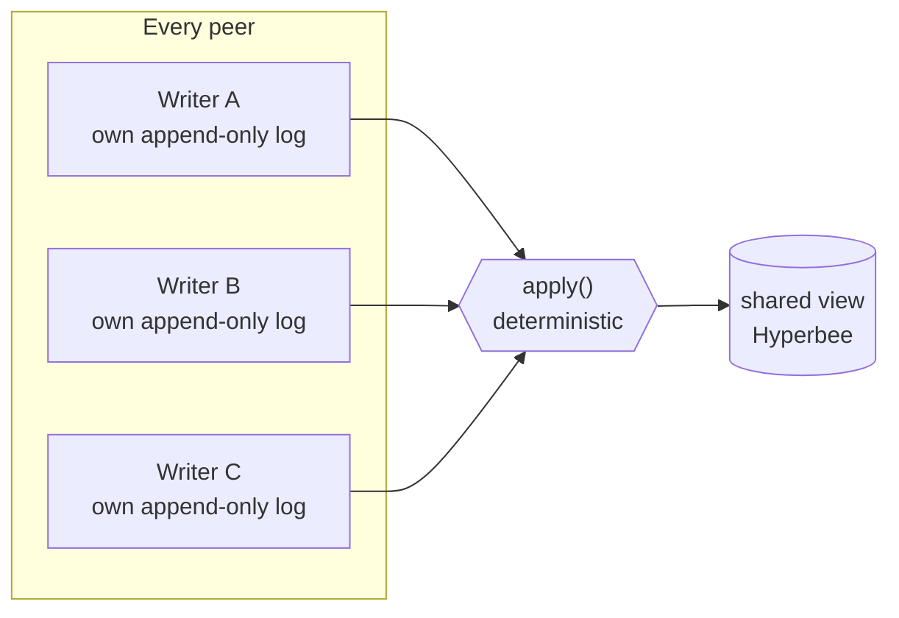
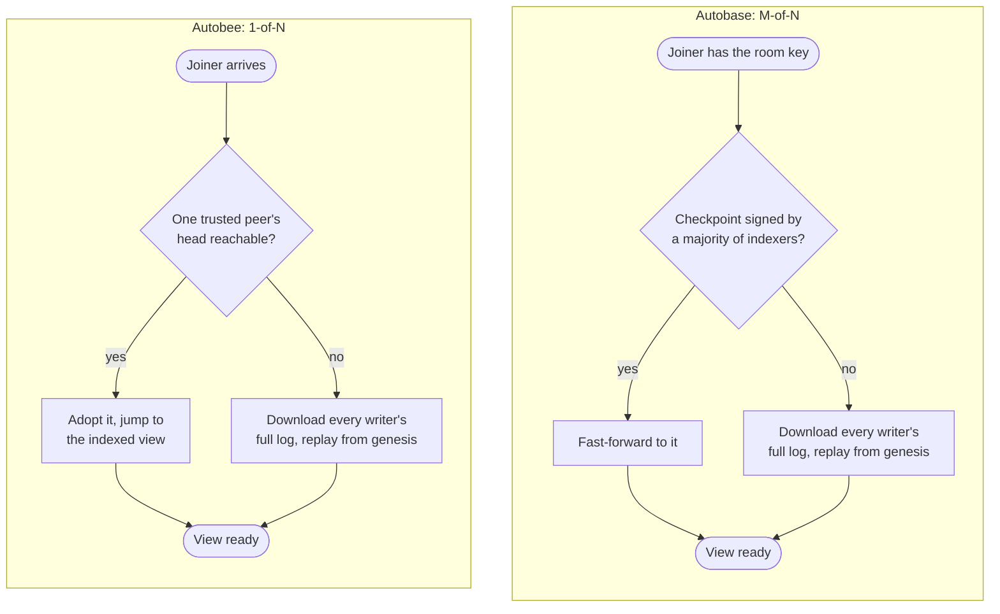

# Autobee: Keet's new collaboration engine

Keet 4.22.0 ships a new engine underneath its rooms. Each room moves onto it the first time your device opens it.

[**Autobee**](https://github.com/holepunchto/autobee) is Keet's new multiwriter engine, built on everything we learned running [**autobase**](https://github.com/holepunchto/autobase) for years.
The core shape hasn't changed:

* Every peer appends to their own signed, append-only log.
* A deterministic `apply` function merges those logs into one shared view.
* No central server owns any of it. Each peer can read and apply all operations independently.

Autobase is still bundled with Keet — it's what migrates a room's old data the first time a device opens that room — but all new room activity runs on autobee.

What autobee actually changes is how a room settles on an order, and, as a direct consequence, how few peers it takes to catch a new device up.

*The shape autobase and autobee both share: each peer's own log feeds a deterministic `apply`, and every peer that has seen the same entries ends up building the same view. What changed is the machinery in the box — how the order going into `apply` gets decided, and what it costs to catch a device up.*

## Why a majority used to stand between you and a fast join

Autobase orders a room's entries as they arrive: every peer runs the same deterministic sort over the causal links between them, so a new message gets a place right away. What autobase adds on top is a committee that locks that order in. A majority of the room's indexers has to reference an entry, and then a majority has to reference *those* references. Autobase calls that a double quorum. Until an entry clears it, its place is provisional: shown, ordered, but still movable. Once it clears, that's it — permanently. Nothing in autobase's undo or reorder logic ever reaches back into confirmed history; only the unconfirmed tip can still move.

That's real, durable finality. But the same majority requirement is exactly what a joining device has to wait on to skip ahead. Autobase can fast-forward a joiner straight to a checkpoint — but only one a majority of indexers have actually signed. Picture a room where enough of the current admins have been offline for a while — on a trip, off the network for whatever reason — that the ones still online can no longer reach a majority. Everyone can still write and read normally; the tip just never confirms. No amount of activity moves that stuck point until enough of those admins reconnect. And a device trying to join or catch up during that stretch has nothing signed-enough to jump to: it has to download every writer's full log and replay `apply` over the whole thing, from genesis. For an old, busy room, that's slow.

## What autobee trades for a faster join

Autobee keeps the ordering and drops the committee. Its sort is adapted more or less directly from autobase's, so every peer still lands on the same order from the same entries — but there's no majority step afterwards, and no round of confirmations to wait on.

That costs something. Autobase's confirmed order was permanent. Autobee's isn't — every entry stays re-sortable for as long as the log exists: if an entry turns up later that belongs earlier in the order, everything after it quietly resorts around it. Autobee never confirms anything; it recomputes instead.

The same trade happens to the view. An autobase view only ever replicated to the network once a majority of indexers had signed it — a real, protocol-level trust anchor: a multisig core, typically the room's admins. Autobee's view lives in an ordinary, single-key Hypercore per peer, so it replicates exactly like anything else, with no signature gating it. Structurally, one peer's view is exactly as shareable as any other's — the protocol itself no longer distinguishes an admin's view from a stranger's. What used to be a guarantee the protocol gave you for free becomes a judgment call the application has to make instead. Keet makes that call itself, in two ways: it only mirrors admins' views, and it only trusts a fast-forward head when its own view says that head belongs to the device an admin it already knows about last wrote from. Trust moved out of the protocol and into Keet — arguably a better place for it to live, since Keet already owns the concept of who's an admin.

What that buys back: fast-forwarding no longer needs a majority. It needs one. Any single peer whose head Keet already trusts is enough to hand a joining device a shortcut straight to the indexed view, pulling view pages as it reads rather than replicating every writer's raw log. In a room where most admins have been away, a single admin's device coming back online is enough to get new devices caught up quickly again — where autobase needed a majority of them.

*Autobase's fast-forward only unlocks once a majority of indexers have signed a checkpoint. Autobee's unlocks the moment a single trusted peer's head is reachable — the fallback cliff is still there if nobody trusted has ever been reachable, it's just far less likely to hit.*

## Limitations

First: there's no longer one canonical state. Autobase produced exactly one canonical signed state for a given history — if the indexers couldn't agree, nothing new got signed at all.
Autobee has no such requirement: each peer computes its own view from whatever entries it currently has and has chosen to include, so two peers can genuinely be looking at different, both individually valid views of the same room at the same moment.
They converge once they've seen the same entries, but nothing forces that to happen first.

Second: the fast-forward shortcut only helps a device arriving cold — joining, pairing, or restoring.
A device reopening a room it already mostly has doesn't get the same jump: it only kicks in once a peer advertises a head 32 or more flushed batches ahead of the device's own view, so a device that's roughly caught up just keeps reading normally. And either way it needs one other device online to hand the state over; with nobody there, it does nothing.

Messages can still shuffle when a device catches up on something it hadn't seen. That hasn't changed, and the new engine counts those reorders as a first-class statistic.

## What happens to rooms you already have

Rooms you had before the upgrade convert once per device, the first time that device opens them — either because you opened the room, or because the app opened it in the background to sync new activity. Rooms your device never opened just sync, with nothing to convert.

The room ID does not change, so old invites and old links still land in the same room. Your old data is not rewritten or discarded: the previous autobase cores are kept read-only so history keeps rendering, for you and for people who join later. The cost: a migrated room is stored twice on your device, and the old copy is never reclaimed.

Above your room list, the app shows a dismissible notice headed "Keet is upgrading for a smoother experience". There is no progress bar: rooms convert in the background as the app catches up, and a room you open yourself converts as part of opening it, so that one takes a moment longer the first time.

Everyone in a room should update. How far a room may upgrade is a moderator action driven by remote config. When a room moves past what an old client supports, that client stops applying the room rather than failing silently — the room freezes where it is, the rest of the app keeps working, and the client raises an update countdown — "Some groups might not work with your current version of Keet. Please update the app to access all your groups." — then restarts into the update when the timer runs out.

If a room doesn't come up after you upgrade, see [Slow groups after updating](https://support.keet.io/technical-support-and-troubleshooting/slow-groups-after-updating).

## Why this matters past this release

The point of the rewrite isn't one number going down. It's a deliberate trade: swapping a heavyweight, majority-vote consensus model — overkill for a chat app — for a lighter one where a single trusted peer is enough to catch a device up. That trade has a price: it gives up the permanent finality and the protocol-level trust guarantee autobase provided. Keet rebuilds the trust side itself, through its admin checks; the finality is simply gone, which a chat app can live with.

It also made Keet simpler:

* **Three views became one.** A room used to carry up to three separate views: the original room view, the newer room database that replaced it, and a separate store for small binary data. On autobee, a room has a single view — its database — so there is one core to replicate, mirror, and fast-forward instead of three.
* **Blob storage was folded into the main database.** Avatars and image previews — small images of up to 512 KB — used to live in their own Hyperblobs core next to the room database. They are now ordinary records inside the database, keyed by a hash of their content, so an image that is already stored isn't written again, and they arrive with the rest of the room's data instead of from a second core. File attachments aren't affected: they are still shared separately from the room's view. Rooms migrated from autobase keep their old blobs core read-only, so older avatars and previews still load.

Room updates now run through a queue that survives a restart, instead of running inline while the room finishes syncing. Two diagnostics went with the old machinery: the tip-size readout now reports zero, and room repair — automatic and manual alike — has no implementation on the new engine yet.

None of it is Keet-only. Autobee is a general multiwriter Hyperbee, an engine any peer-to-peer app with many writers could build on. It's [open source](https://github.com/holepunchto/autobee); come discuss it with us in the Keet development rooms.
