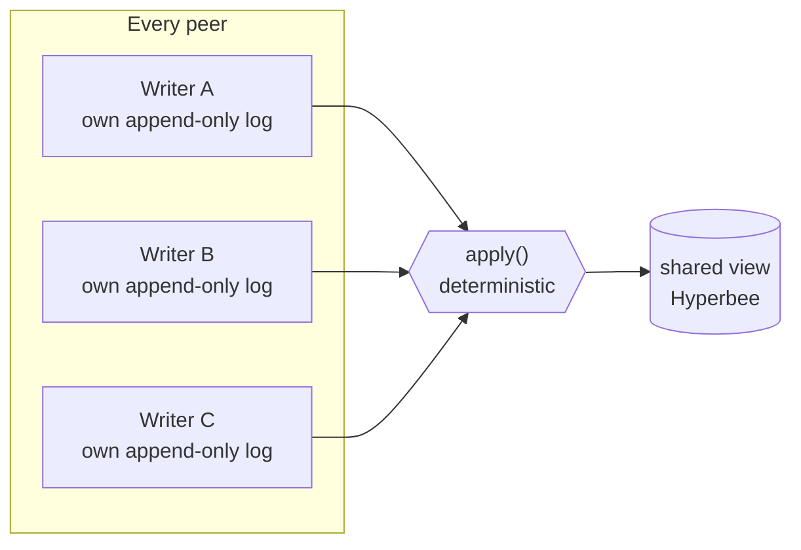
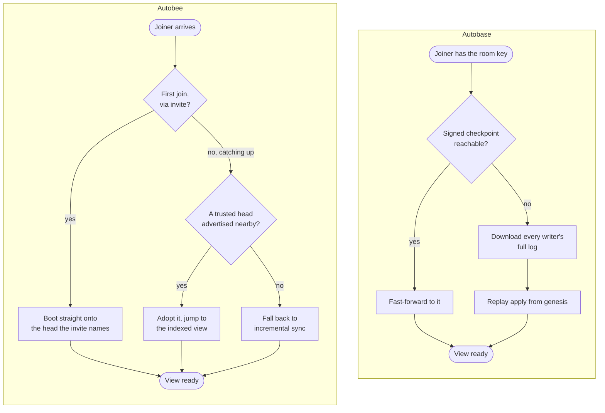

# Autobee: Keet's new collaboration engine

Keet 4.22.0 ships a new engine underneath its rooms. Your rooms move onto it the first time you open them.

For years, Keet's rooms ran on [**autobase**](https://github.com/holepunchto/autobase): multiple peers each appending to their own signed, append-only log, with a deterministic `apply` function merging those logs into one shared view. Ordering was eventually consistent: once a quorum of the room's indexers confirmed a prefix, it was frozen and identical everywhere, while the unconfirmed tip could still be reordered and reapplied on each device.
No central server owned that state: a quorum of the room's own indexing writers settled it, not an outside authority.
It worked, it shipped, and it taught us where the seams were. Autobase is still bundled with Keet, as it is used to migrate old room data. But all new room data will use [**autobee**](https://github.com/holepunchto/autobee).

[**autobee**](https://github.com/holepunchto/autobee) is a rebuilt open source peer-to-peer collaboration engine shipping in Keet 4.22.0.

## The engine is a rewrite

The idea stays the same: your own log and everyone's logs merged deterministically into one view. What changed is how peers arrive at the order.

*The shape autobase and autobee both share: each peer's own log feeds a deterministic `apply`, and every peer ends up building the same view. What changed between them is the machinery under the hood, how the order going into `apply` gets decided.*

## Differences between autobase and autobee

| | Autobase | Autobee |
|---|---|---|
| **Deciding final order** | Consensus over a designated indexer set. A node is locked in once a majority of indexers have referenced it and a majority have then referenced those references — autobase calls this a double quorum — and by its own design rules that quorum has to lead any rival quorum by two degrees, or the two could still swap places. | One fixed rule, the same on every peer. Order comes from a writer's weight — which has to be granted, not claimed — under the causal links each entry carries, with the writer's own clock stamp, then its key, breaking ties. Every input to that decision — the links, the stamp, the grant citation the weight resolves from — is written into the entry at the moment it is appended. |
| **Waiting on other peers** | Messages show up immediately, but their order only locks in once a majority of indexers keep confirming it — until then, messages are still ordered and shown; they can just get reshuffled. | Nothing about the ordering is put to a vote. (One majority does survive, and only during the move off autobase: to find the newest legacy system core, autobee polls the old room's indexers and takes the majority answer.) A writer does need one writer already standing at that weight or above to sign off before its weight counts — and that sign-off is just another entry in the log. |
| **Trusting the view** | Each view is a multi-signature Hypercore whose signers are the current indexer set. Indexers embed per-view signatures in their own logs; every peer collects and assembles them. | No quorum signature on the view — no signed length to wait for and no signatures to collect from anyone. Any peer with the room key rebuilds the view itself. A peer that instead adopts someone else's view leans on knowing who that peer is. |
| **Background traffic** | Every indexer runs its own timer: it checks in every ten to twenty seconds and writes a block with no message in it whenever that would help the group agree. Those blocks are also how an indexer publishes its signatures. So the more indexers, the more of them in the log. | No timer. What the protocol needs rides along on entries you were already writing — though the version Keet ships still adds the occasional empty block around membership changes or to acknowledge another peer's optimistic write. |
| **Changing the writer set** | Adding or removing an indexer changes a view's signers, which changes its key — and migrates the whole base. | Writers carry a weight. A raise is a normal in-contract operation, nothing gets re-keyed, but it needs a grant from a writer already standing at that weight or above. The new standing counts from the writer's next entry, when it cites the grant, not the moment the grant lands.|
| **Joining a room with history** | Jump to the last checkpoint the indexers signed, if the joiner can reach one — otherwise download every writer's log and re-run `apply` over the whole history. | Boot straight onto the head the invite names. If catching up later, adopt a head that a trusted peer already vouched for, stamped into that peer's own log. |

## Why we think big rooms will open faster

Autobase could already jump a joiner forward to a system checkpoint a majority of the indexers had signed, once the joiner was at least sixteen system versions behind that checkpoint.
Under sixteen, it didn't try. Each read on the way (the system tip, each view's tip, each indexer's tip) got five seconds to land.
Missing one abandoned the attempt, though not permanently: it waited out a five-minute cooldown and tried again.
In the meantime it fell back to the slow path: pulling down every writer's log and replaying the whole thing locally.

Autobee moves that forward-jump into the log itself.
Every time a writer flushes, it stamps the head it vouches for into its own log.
This means a joiner can pick up a trustworthy head from any log it wakes up on, not only the one its invite named.
Keet supplies the judgement: a head is trusted when our own view says it belongs to the device an active admin most recently wrote from, and among those, the most recently active admin wins.
The joiner adopts that head, moves onto the indexed view, and pulls view pages as it reads them. It never replicates the room's raw logs end to end.

*Autobase's fast-forward needs a reachable, indexer-signed checkpoint or it falls back to downloading and replaying every writer's log.
Autobee has no such fallback cliff: a fresh invite boots straight onto a head, and catching up later means adopting a head some other peer's own log already vouches for, stamped there the same way any other entry is.*

### Limitations

Two honest limits. This helps most when a device first picks a room up, joining, pairing, or restoring.
Those take the shortcut whenever it is available to them.
Reopening a room you already have usually doesn't. In this case the engine only jumps if it is more than 32 flushed batches behind. A device that is roughly caught up just carries on reading.
That 32 counts batches where autobase's sixteen counted system versions — different units, so the two thresholds are not a like-for-like comparison.
And either way it needs another device online to hand the state over; with nobody there, it does nothing.

Messages can still shuffle when a device catches up on something it hadn't seen. That hasn't changed, and the new engine counts those reorders as a first-class statistic.

## How a room moves over

The mechanics of the move are worth spelling out, because they explain most of what you see.
A room converts once per device, the first time that device opens a room it had already used. In this case, autobee keys off the pre-autobee boot state sitting in local storage.
A room this device never opened simply syncs.

### When there is something to convert

#### 1. Read the old boot record

Migration takes the boot pointer and the room's encryption key out of autobase's local storage, then clears them. That is what makes the move one-way: once a room is converted, there is no pointer left to go back to.

#### 2. Find the newest legacy state

From that pointer it chases autobase's checkpoint back-pointers, and asks the old room's indexers which legacy system core is current, taking the majority answer. This is the one place a majority still decides anything, and it exists only to read rooms that predate autobee.

#### 3. Resolve the old views

Autobee hands back pointers, not data. Keet opens those cores itself, read-only, and points the new engine at them rather than rebuilding anything.

#### 4. Keep them reachable

The old views and the legacy system head are mirrored rather than dropped, because remote readers resolve into them. That is what keeps old history rendering for someone who arrives later.

#### 5. Publish the reference points

Once a moderator who ran the migration opens the room, their client dispatches those heads into the room. People who join afterwards can read the old history without ever running a migration themselves.

This step has a gap worth naming: in a room where you are not a moderator — a DM, for instance — it is never dispatched, and your device keeps those pointers to itself.

## What you'll notice when you upgrade

### Rooms need to upgrade

The first time you open a room you'd already used is in the new release, Keet upgrades that room's local data in place — once per room, on each of your devices.
That can happen when you open the room, or on its own in the background as the app catches up on rooms with pending changes.
Rooms your device never opened on the old release skip the upgrade entirely and just sync.

Above your room list, the app shows a dismissible notice headed "Keet is upgrading for a smoother experience". There's no progress bar for it yet: rooms that need to catch up convert in the background. A room you open yourself converts as part of opening it, so that room takes a moment longer the first time.

### Room IDs don't change

You can still invite people to it, and they join the same room.
Your old data isn't rewritten or discarded either.
The previous autobase cores are kept read-only and stay readable, so history keeps rendering.
That has a cost worth stating plainly: a migrated room is stored twice on your device. The old copy is never rewritten, but it isn't reclaimed either.

### Everyone in a room should update

How far a room is allowed to upgrade is a moderator action driven by remote config, not something the migration decides on its own.
When a room does move past what an old client supports, that client stops applying the room rather than silently failing.
The room freezes where it is while the rest of the app keeps working, and the client raises an update countdown — "Some groups might not work with your current version of Keet. Please update the app to access all your groups." — then restarts into the update when the timer runs out.

The migration doesn't run backwards, and downgrading Keet won't undo it. If a room doesn't come up after you upgrade, see [Slow groups after updating](https://support.keet.io/technical-support-and-troubleshooting/slow-groups-after-updating).

## Why this matters past this release

The point of the rewrite isn't one number going down.
It's that Keet is simpler: three stacked views became one, blob storage was folded into the main database, and Keet no longer runs a linearizer at all.
Autobase is still in the build, but keet-core's only remaining call into it now reads the boot record of a pre-migration room.
Room updates now run through a queue that survives a restart, instead of running inline while the room finishes syncing.

Two diagnostics went with the old machinery: the tip-size readout now reports zero, and room repair (automatic and manual alike) has no implementation on the new engine yet.

None of it is Keet-only. Autobee is a general multiwriter Hyperbee, an engine any peer-to-peer app with many writers could build on. It's [open source](https://github.com/holepunchto/autobee); come discuss with us about it in the Keet development rooms.