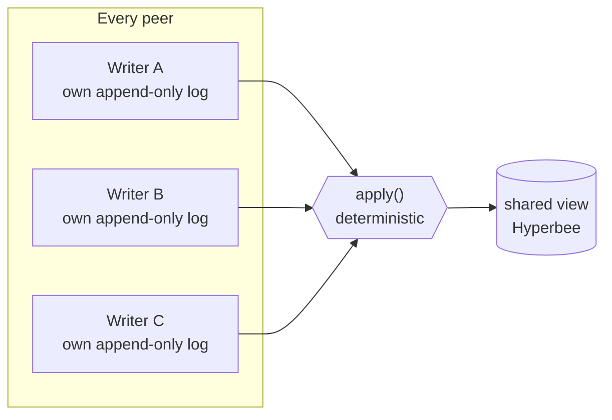
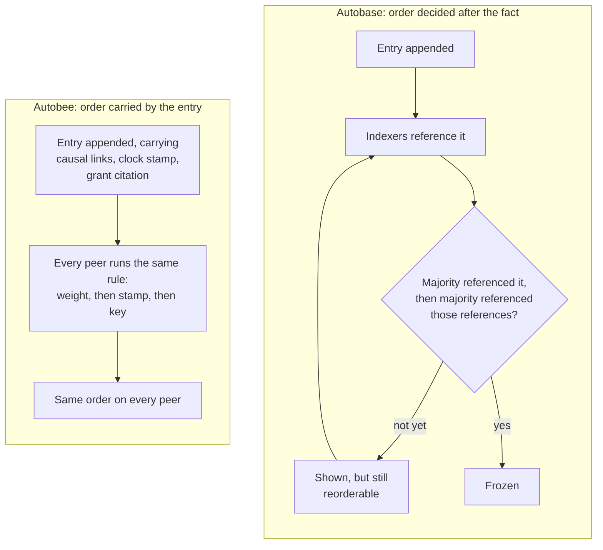

# Autobee: Keet's new collaboration engine

Keet 4.22.0 ships a new engine underneath its rooms. Your rooms move onto it the first time you open them.

For years, Keet's rooms ran on [**autobase**](https://github.com/holepunchto/autobase): multiple peers each appending to their own signed, append-only log, with a deterministic `apply` function merging those logs into one shared view. Ordering was eventually consistent: once a quorum of the room's indexers confirmed a prefix, it was frozen and identical everywhere, while the unconfirmed tip could still be reordered and reapplied on each device.
No central server owned that state: a quorum of the room's own indexing writers settled it, not an outside authority.
It worked, it shipped, and it taught us where the seams were. Autobase is still bundled with Keet, as it is used to migrate old room data. But all new room data will use [**autobee**](https://github.com/holepunchto/autobee).

[**autobee**](https://github.com/holepunchto/autobee) is a rebuilt open source peer-to-peer collaboration engine shipping in Keet 4.22.0.

## The shape that stayed the same

The idea stays the same: your own log and everyone's logs merged deterministically into one view. What changed is how peers arrive at the order.

*The shape autobase and autobee both share: each peer's own log feeds a deterministic `apply`, and every peer ends up building the same view. What changed between them is the machinery under the hood, how the order going into `apply` gets decided.*

## Differences between autobase and autobee

| | Autobase | Autobee |
|---|---|---|
| **[Deciding final order](#why-order-no-longer-waits-on-a-vote)** | Consensus over a designated indexer set. A node is locked in once a majority of indexers have referenced it and a majority have then referenced those references — autobase's code calls this double confirming. | One fixed rule, the same on every peer. Order comes from a writer's weight — which has to be granted, not claimed — under the causal links each entry carries, with the writer's own clock stamp, then its key, breaking ties. Every input to that decision — the links, the stamp, the grant citation the weight resolves from — is written into the entry at the moment it is appended. |
| **[Waiting on other peers](#why-order-no-longer-waits-on-a-vote)** | Messages show up immediately, but their order only locks in once a majority of indexers keep confirming it — until then, messages are still ordered and shown; they can just get reshuffled. | Nothing about the ordering is put to a vote. A writer does need one writer already standing at that weight or above to sign off before its weight counts — and that sign-off is just another entry in the log. |
| **[Trusting the view](#why-any-peer-can-rebuild-the-view-alone)** | Each view is a multi-signature Hypercore whose signers are the current indexer set. Indexers embed per-view signatures in their own logs; every peer collects and assembles them. | No quorum signature on the view — no signed length to wait for and no signatures to collect from anyone. Any peer with the room key rebuilds the view itself. A peer that instead adopts someone else's view leans on knowing who that peer is. |
| **[Background traffic](#why-quiet-rooms-stay-quiet)** | Every indexer runs its own timer: it checks in every ten to twenty seconds and writes a block with no message in it whenever that would help the group agree. Those blocks are also how an indexer publishes its signatures. So the more indexers, the more of them in the log. | No timer. What the protocol needs rides along on entries you were already writing — though a writer the room trusts (in Keet, an active admin's device) still appends an empty block once it has fallen 32 flushes behind its own last one. |
| **[Changing the writer set](#why-promoting-a-writer-no-longer-moves-the-room)** | Adding or removing an indexer changes a view's signers, which changes its key — and migrates the whole base. | Writers carry a weight. A raise is a normal in-contract operation, nothing gets re-keyed, but it needs a grant from a writer already standing at that weight or above. The new standing counts from the writer's next entry, when it cites the grant, not the moment the grant lands.|
| **[Joining a room with history](#why-we-think-big-rooms-will-open-faster)** | Jump to the last checkpoint the indexers signed, if the joiner can reach one — otherwise download every writer's log and re-run `apply` over the whole history. | Boot straight onto the head the invite names. If catching up later, adopt a head that a trusted peer already vouched for, stamped into that peer's own log. |

## Why we think big rooms will open faster

Autobase could already jump a joiner forward to a system checkpoint a majority of the indexers had signed, once the joiner was at least sixteen system versions behind that checkpoint.
Under sixteen, it didn't try. Each read on the way (the system tip, each view's tip, each indexer's tip) got five seconds to land.
Missing one abandoned the attempt, though not permanently: it waited out a five-minute cooldown and tried again.
In the meantime it fell back to the slow path: pulling down every writer's log and replaying the whole thing locally.

Autobee moves that forward-jump into the log itself.
Every time a writer flushes, it stamps the head it vouches for into its own log.
This means a joiner can pick up a trustworthy head from any log it wakes up on, not only the one its invite named.
Keet supplies the judgement: a head is trusted when our own view says it belongs to the device an active admin most recently wrote from, and among those, the most recently active admin wins.
The joiner adopts that head, moves onto the indexed view, and pulls view pages as it reads them.

*Autobase's fast-forward needs a reachable, indexer-signed checkpoint or it falls back to downloading and replaying every writer's log.
Autobee has no such fallback cliff: a fresh invite boots straight onto a head, and catching up later means adopting a head some other peer's own log already vouches for, stamped there the same way any other entry is.*

### Limitations

Two honest limits. This helps most when a device first picks a room up, joining, pairing, or restoring.
Those take the shortcut whenever it is available to them.
Reopening a room you already have usually doesn't. In this case the engine only jumps if it is more than 32 flushed batches behind. A device that is roughly caught up just carries on reading.
That 32 counts batches where autobase's sixteen counted system versions — different units, so the two thresholds are not a like-for-like comparison.
And either way it needs another device online to hand the state over; with nobody there, it does nothing.

Messages can still shuffle when a device catches up on something it hadn't seen. That hasn't changed, and the new engine counts those reorders as a first-class statistic.

## Why order no longer waits on a vote

Under autobase, an entry's place in the room was not settled by the entry itself. It was settled afterwards, by other people: a majority of the indexer set had to reference it, and then a majority had to reference those references. Autobase calls that a double quorum, and its design rules require the winning quorum to lead any rival by two degrees — one degree isn't enough, because two quorums that close could still swap places. Until that lead exists, the tip is provisional. It is shown, it is ordered, and it can still be reshuffled.

Autobee settles order from the entry alone. Every input to the decision is already inside the entry when it is appended: the causal links back to what its writer had seen, the writer's own clock stamp, and the citation for the grant its weight resolves from. Ordering is then one fixed rule, run identically on every peer — weight first, then the clock stamp, then the writer's key, with the entry's own position in that writer's log settling anything still tied. There is no round of confirmations to wait for, because there is nothing left to confirm.

*Autobase's order is a fact about the room's indexers; autobee's is a fact about the entry.*

One thing this does not buy: an entry you have never seen still slots in when it arrives, and everything after it moves down. Rules can be evaluated the moment an entry lands, but they cannot be evaluated on an entry that hasn't arrived yet. What goes away is the second source of movement — the one where nothing new arrived and the order changed anyway, because the indexers had not finished agreeing.

Weights are the one thing a writer cannot decide for itself. A writer's weight only counts once a writer already standing at that weight or above has signed off on it, and that sign-off is not a side channel: it is an ordinary entry in an ordinary log, replicated like everything else. So even the input that ranks writers against each other is settled by the same append-only machinery as the messages.

## Why any peer can rebuild the view alone

An autobase view was a multi-signature Hypercore, and its signers were the current indexer set. Every indexer embedded its per-view signatures into its own log, and every peer collected those signatures and assembled them before it could trust a given length of the view. That is a real dependency: the signatures have to exist, and you have to be able to reach the logs carrying them.

Autobee drops the quorum signature from the view entirely. There is no signed length to wait for and no signatures to gather from anyone. Any peer holding the room key derives the view itself, from the entries, by the same fixed rule everyone else runs. The view stops being a thing you are handed and becomes a thing you compute.

The tradeoff is worth naming. Because the view carries no quorum signature, a peer that skips the computation and adopts someone else's view is trusting that peer, not a signature set. That is exactly what the fast-open path above does — and why it leans on Keet's own view of who the admins are, rather than on anything the view itself proves.

## Why quiet rooms stay quiet

Under autobase, an idle room was not idle on disk. Every indexer ran its own timer, checked in every ten to twenty seconds, and wrote a block with no message in it whenever that would help the group agree. Those empty blocks were also how an indexer published its view signatures, so they were not optional bookkeeping — they were how consensus and trust got carried. The cost scaled the wrong way: the more indexers a room had, the more of them ended up in the log, whether or not anyone was talking.

Autobee has no timer. There is nothing to check in about, because ordering isn't a group decision, and there are no view signatures to publish. What the protocol needs rides along on entries you were already writing.

Autobee isn't perfectly free of empty blocks. A writer the room trusts — in Keet, a device belonging to an active admin — appends one once it has fallen 32 flushes behind its own last one, which keeps the room's current state anchored in a log other peers already follow. Ordinary members never write them. The difference from autobase is what drives it: how far the room has actually moved, not a clock. A room nobody writes to doesn't move, so nothing gets written.

## Why promoting a writer no longer moves the room

Changing autobase's indexer set was structural. The indexers were the view's signers, so adding or removing one changed the view's key, and changing the key migrated the whole base. A membership change was, mechanically, a new base.

In autobee, standing is a number a writer carries, and raising it is an ordinary in-contract operation. Nothing gets re-keyed and nothing migrates. What the operation needs is a grant from a writer already standing at that weight or above — the same rule that keeps weight from being self-assigned.

There is one piece of timing worth knowing. The new standing does not take effect the moment the grant lands. It counts from the promoted writer's next entry, the one that cites the grant. Promotion is something a writer claims by writing, not something that happens to it in the background.

## What happens to rooms you already have

Rooms you had before the upgrade convert once per device, the first time that device opens them. Rooms your device never opened just sync, with nothing to convert.

The room ID does not change, so old invites and old links still land in the same room. Your old data is not rewritten or discarded: the previous autobase cores are kept read-only so history keeps rendering, for you and for people who join later. That has a cost worth stating plainly — a migrated room is stored twice on your device, and the old copy is never reclaimed.

Above your room list, the app shows a dismissible notice headed "Keet is upgrading for a smoother experience". There is no progress bar: rooms convert in the background as the app catches up, and a room you open yourself converts as part of opening it, so that one takes a moment longer the first time.

Everyone in a room should update. How far a room may upgrade is a moderator action driven by remote config. When a room moves past what an old client supports, that client stops applying the room rather than failing silently — the room freezes where it is, the rest of the app keeps working, and the client raises an update countdown — "Some groups might not work with your current version of Keet. Please update the app to access all your groups." — then restarts into the update when the timer runs out.

If a room doesn't come up after you upgrade, see [Slow groups after updating](https://support.keet.io/technical-support-and-troubleshooting/slow-groups-after-updating).

## Why this matters past this release

The point of the rewrite isn't one number going down.
It's that Keet is simpler: three stacked views became one, blob storage was folded into the main database, and Keet no longer runs a linearizer at all.
Room updates now run through a queue that survives a restart, instead of running inline while the room finishes syncing.

Two diagnostics went with the old machinery: the tip-size readout now reports zero, and room repair (automatic and manual alike) has no implementation on the new engine yet.

None of it is Keet-only. Autobee is a general multiwriter Hyperbee, an engine any peer-to-peer app with many writers could build on. It's [open source](https://github.com/holepunchto/autobee); come discuss with us about it in the Keet development rooms.
